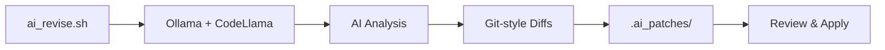

# AI Revision Overview

## 🤖 SyferStackV2 AI-Driven Code Improvement System

This document outlines the AI-powered revision system implemented in SyferStackV2 to systematically improve code quality, security, and production-readiness using Ollama + CodeLlama.

## 🎯 Purpose

The AI revision system automatically analyzes critical system files and generates production-ready improvements without manual intervention, ensuring consistent code quality and adherence to best practices.

## 🏗️ Architecture



## 📋 Improvement Areas

### 1. **Observability & Monitoring**
- ✅ Prometheus `/metrics` endpoint integration
- ✅ Health check `/health` with uptime tracking
- 🎯 Structured JSON logging implementation
- 🎯 Application performance monitoring (APM)
- 🎯 Distributed tracing setup

### 2. **Security Hardening**
- 🎯 Nginx TLS configuration and security headers
- 🎯 Rate limiting and CORS policy optimization
- 🎯 TrustedHostMiddleware configuration
- 🎯 Security scanning integration (Bandit + Trivy)
- 🎯 Dependency vulnerability management

### 3. **Infrastructure & DevOps**
- 🎯 Docker Compose with Prometheus + Grafana
- 🎯 CI/CD pipeline enhancements
- 🎯 Automated security scanning workflows
- 🎯 Container optimization and multi-stage builds
- 🎯 Environment-specific configurations

### 4. **Code Quality & Standards**
- 🎯 Type safety and static analysis
- 🎯 Error handling and logging standards
- 🎯 API documentation and validation
- 🎯 Performance optimization patterns
- 🎯 Testing coverage improvements

## 🔧 Usage

### Quick Start
```bash
# Linux/WSL
./ai_revise.sh

# Windows
ai_revise.bat
```

### Manual Process
1. **Generate Patches**:
   ```bash
   ./ai_revise.sh
   ```

2. **Review Generated Diffs**:
   ```bash
   ls -la .ai_patches/
   cat .ai_patches/*.diff
   ```

3. **Apply Patches**:
   ```bash
   # Apply all patches
   for p in .ai_patches/*.diff; do 
     git apply $p || echo "Failed: $p"
   done
   
   # Apply individual patches
   git apply .ai_patches/main.py.diff
   ```

4. **Verify Changes**:
   ```bash
   git status
   git diff
   ```

## 📁 Target Files

| File | Purpose | Improvements |
|------|---------|-------------|
| `backend/app/main.py` | FastAPI application | Middleware, security, monitoring |
| `backend/nginx/nginx.conf` | Web server config | TLS, headers, performance |
| `backend/docker-compose.yml` | Container orchestration | Services, monitoring stack |
| `.github/workflows/backend.yml` | CI/CD pipeline | Security scans, quality gates |

## 🎛️ Configuration

### AI Model Settings
```bash
MODEL="codellama:latest"          # Primary model
OUT_DIR=".ai_patches"             # Output directory
PROMPT_FILE=".ai_prompt.txt"      # System prompt
```

### Prompt Engineering
The system uses carefully crafted prompts to ensure:
- **Focused Output**: Only git-style diffs, no explanations
- **Production Focus**: Enterprise-grade improvements
- **Best Practices**: Industry-standard implementations
- **Security First**: Security-conscious modifications

## 🛡️ Safety Measures

### Review Process
1. **Never Auto-Apply**: All patches require manual review
2. **Incremental**: Apply patches one by one for easier rollback
3. **Testing**: Validate each change in development environment
4. **Documentation**: Track applied improvements in commit messages

### Quality Assurance
```bash
# Pre-application checks
git status --porcelain  # Ensure clean working tree
git stash              # Backup uncommitted changes

# Post-application validation
docker compose build   # Verify build integrity
pytest                # Run test suite
docker compose up     # Test deployment
```

## 📊 Metrics & Monitoring

### Success Indicators
- ✅ **Build Success Rate**: Docker builds complete without errors
- ✅ **Test Pass Rate**: All tests pass after applying patches
- ✅ **Security Score**: Reduced vulnerabilities in scans
- ✅ **Performance**: Response time improvements

### Tracking Progress
```bash
# Before AI revision
git tag ai-revision-baseline-$(date +%Y%m%d)

# After applying patches
git tag ai-revision-applied-$(date +%Y%m%d)

# Compare improvements
git diff ai-revision-baseline-20251009 ai-revision-applied-20251009
```

## 🚀 Best Practices

### 1. **Regular Runs**
- Run weekly during development
- Run before major releases
- Run after dependency updates

### 2. **Selective Application**
```bash
# Review each diff before applying
for diff in .ai_patches/*.diff; do
  echo "=== Reviewing $diff ==="
  cat "$diff"
  read -p "Apply this patch? (y/n): " choice
  [[ $choice == "y" ]] && git apply "$diff"
done
```

### 3. **Integration with Workflow**
```yaml
# .github/workflows/ai-review.yml
name: AI Code Review
on:
  schedule:
    - cron: '0 2 * * 1'  # Weekly Monday 2AM
jobs:
  ai-review:
    runs-on: ubuntu-latest
    steps:
      - uses: actions/checkout@v4
      - name: Run AI Revision
        run: ./ai_revise.sh
      - name: Create PR with improvements
        uses: peter-evans/create-pull-request@v5
```

## 🔍 Troubleshooting

### Common Issues

**Ollama Not Running**:
```bash
# Start Ollama service
ollama serve &
ollama pull codellama:latest
```

**Patch Application Failures**:
```bash
# Check for conflicts
git apply --check .ai_patches/filename.diff

# Apply with 3-way merge
git apply --3way .ai_patches/filename.diff
```

**Model Performance Issues**:
```bash
# Use different model
MODEL="llama2:13b" ./ai_revise.sh

# Increase context window
ollama run codellama:latest --context-size 4096
```

## 🔄 Evolution & Updates

### Version History
- **v1.0**: Basic diff generation for core files
- **v1.1**: Enhanced security focus and monitoring
- **v2.0**: Multi-model support and workflow integration

### Future Enhancements
- [ ] **Multi-Model Comparison**: Compare outputs from different AI models
- [ ] **Automated Testing**: Run tests before patch generation
- [ ] **Custom Prompts**: File-specific improvement prompts
- [ ] **Interactive Mode**: Real-time patch review and application
- [ ] **Rollback System**: Easy undo for applied changes

## 📚 Related Documentation

- [Security Guidelines](./SECURITY.md)
- [Development Setup](./DEVELOPMENT.md)
- [CI/CD Pipeline](./CICD.md)
- [Monitoring & Observability](./MONITORING.md)

---

> **Note**: This AI revision system is designed to augment human decision-making, not replace it. Always review and test generated improvements before applying them to production systems.